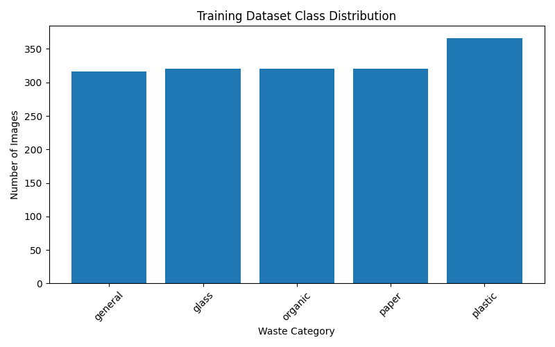
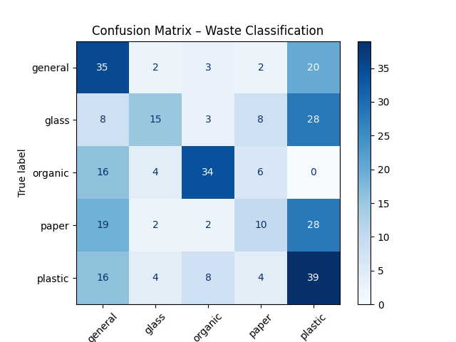
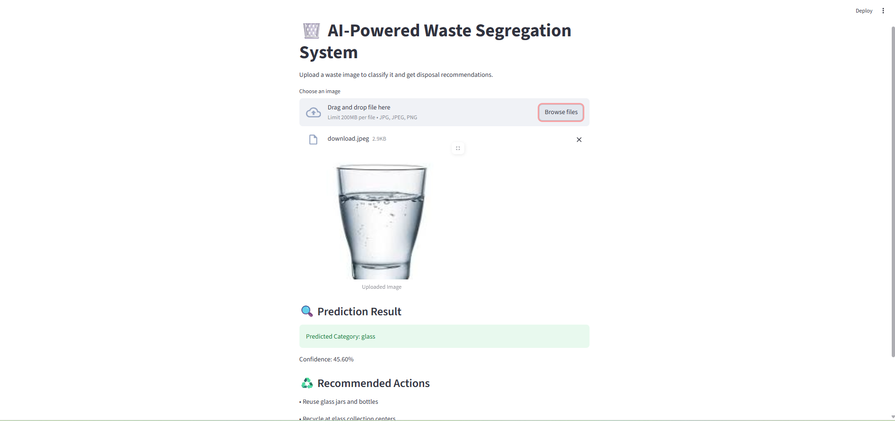

# AI-Powered Waste Segregation System
A deep learning–based system for classifying waste images with confidence-aware predictions to handle visually similar materials.

## Project Overview
This project focuses on building an image-based waste classification system using deep learning. The goal is to automatically categorize waste into appropriate classes using visual features, while handling ambiguity that arises from visually similar materials such as glass, plastic, and paper.

## Problem Statement
Manual waste segregation is inefficient and inconsistent. Image-based automation is challenging due to overlapping visual features across waste categories.

## Approach
 A deep learning–based classification model using transfer learning (MobileNetV2) was implemented, supported by dataset analysis, class imbalance handling, and confidence-aware prediction.

 ## User Interface
A simple Streamlit-based interface was developed to allow users to upload waste images and view predictions directly on screen.  
Low-confidence or mixed-waste cases are flagged as *Uncertain* to avoid incorrect classification.

## Technologies Used
- Python
- TensorFlow / Keras
- OpenCV
- NumPy, Matplotlib
- Scikit-learn

## Methodology
1. Image preprocessing and augmentation
2. CNN-based feature extraction
3. Dataset analysis and class distribution study
4. Model training with class weighting
5. Evaluation using confusion matrix
6. Confidence-aware prediction with uncertainty handling

## Key Features
- Automated waste image classification  
- Dataset distribution analysis and confusion matrix evaluation  
- Confidence-aware prediction with mixed-waste detection  
- Simple Streamlit-based user interface 
- Category-specific waste management recommendations (reduce, reuse, recycle, compost)

## How to run
python train.py
python dataset_analysis.py
python confusion_matrix.py
python predict.py

## Evaluation
Model performance was evaluated using dataset distribution analysis and confusion matrices to identify misclassification between similar waste categories.

## Dataset Distribution

## Confusion matrix

## Sample Prediction

## Limitations
Visual similarity between waste types can cause ambiguity. Future improvements include transfer learning models and a simple web interface.

## Note
Some TensorFlow warnings may appear during inference due to internal framework deprecations. These do not affect model performance or prediction results.

## Future Enhancements
- Transfer learning using MobileNet/EfficientNet
- Web-based user interface
- IoT-based smart waste bins
