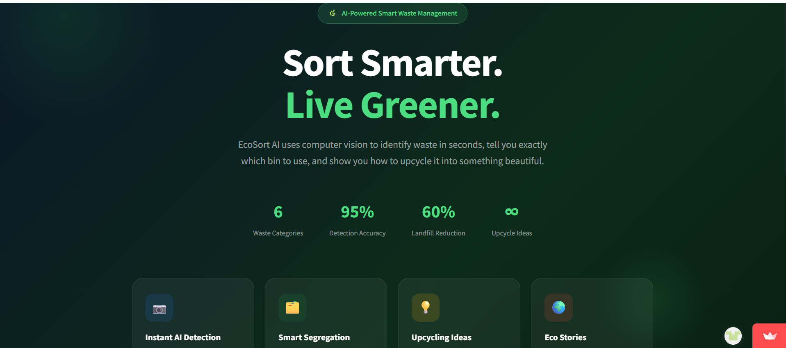
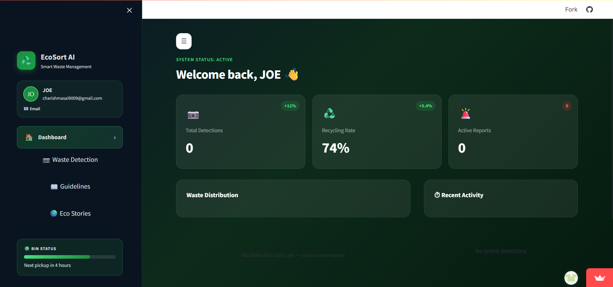
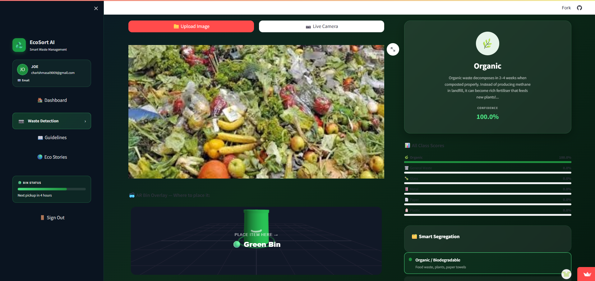
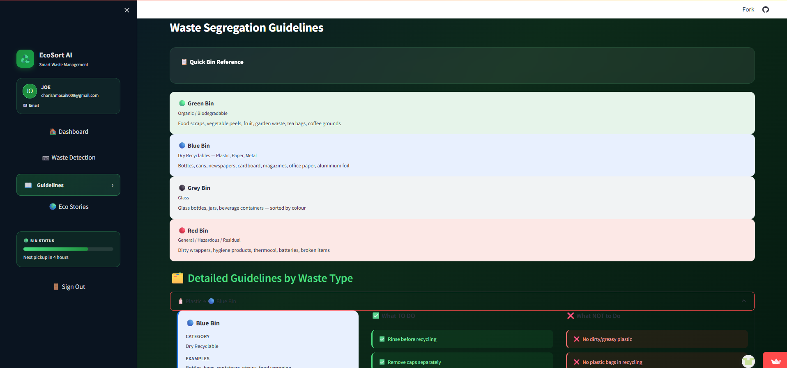
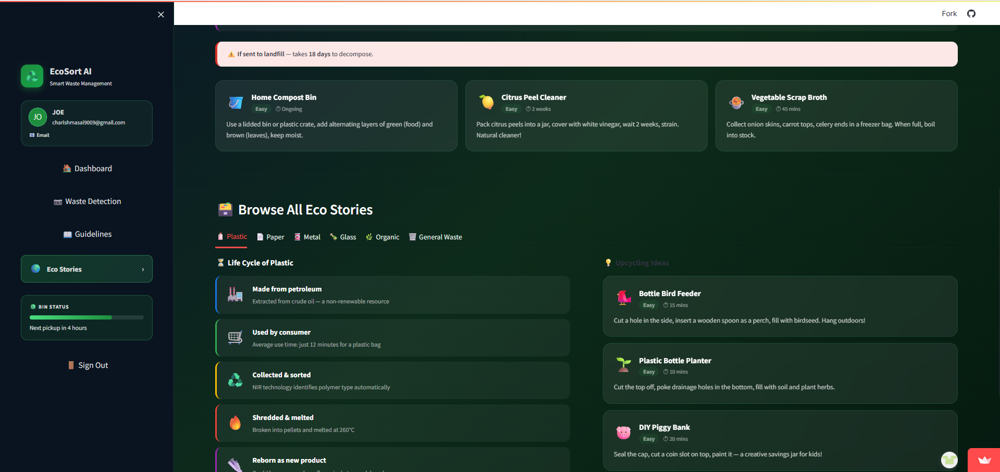
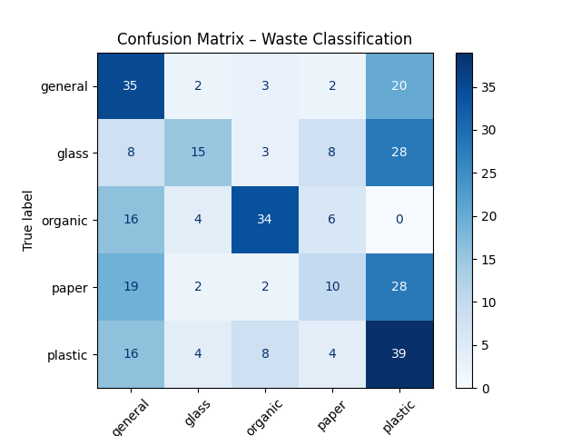
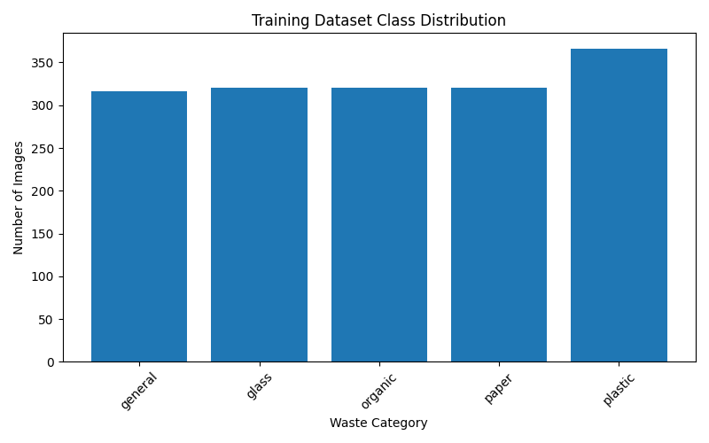

<div align="center">

<h1>♻️ EcoSort AI — Smart Waste Management System</h1>

<p><em>AI-powered waste classification with lifecycle stories, AR bin overlays, and upcycling ideas</em></p>


**[🚀 Live Demo](https://ai-powered-waste-segregation99.streamlit.app/) · [📦 Installation](#installation) · [🧠 Model Details](#model-architecture) · [📸 Screenshots](#screenshots)**

</div>

---

## 📌 Overview

**EcoSort AI** is a full-stack intelligent waste management system that uses **MobileNetV2 transfer learning** to classify waste images into 6 categories in real time. It goes far beyond classification — with a stunning dark-themed animated UI, AR bin overlays powered by Three.js, waste lifecycle journeys, AI-generated upcycling ideas, and a complete segregation guidelines panel.

> Built to be deployable, polished, and portfolio-ready. Live on Streamlit Cloud.

---

## 📸 Screenshots

<!-- 
  HOW TO ADD SCREENSHOTS:
  1. Visit https://ai-powered-waste-segregation99.streamlit.app/
  2. Screenshot each page and save to assets/ folder
  3. Replace each placeholder below with: 
-->
| Landing Page | Dashboard |
|---|---|
|  |  |

| Waste Detection | Guidelines |
|---|---|
|  |  |

| Eco Stories | |
|---|---|
|  | |

## ✨ Features

| Feature | Description |
|---|---|
| 🚀 **Animated Landing Page** | Hero screen with floating orbs, feature cards, and step-by-step how-it-works |
| 🔐 **Auth System** | Email + Google Sign-In via `auth_module.py` with session management |
| 🔍 **AI Classification** | MobileNetV2 classifies waste into 6 categories with confidence scores |
| 📷 **Upload + Live Camera** | Upload images or use live camera for instant detection |
| 🤖 **Claude AI Fallback** | If local model not found, automatically uses Claude Vision API |
| 🥽 **AR Bin Overlay** | Three.js 3D animated bin rendering — shows exactly which bin to use |
| 📊 **Dashboard** | KPI cards, waste distribution bar chart, recent activity feed |
| ♻️ **Lifecycle Journey** | 5-stage visual lifecycle journey for each waste type |
| 💡 **Upcycling Ideas** | Step-by-step DIY upcycle project cards per waste category |
| 📋 **Segregation Guide** | Detailed Do's & Don'ts with fun facts per waste type |
| 🌍 **Eco Stories** | Tabbed browsing of all 6 categories with lifecycle + upcycling content |
| 🌙 **Dark Theme UI** | Fully dark-themed, animated, responsive UI with custom CSS |

---

## 🗂️ Waste Categories

The model classifies waste into **6 classes**:

| Icon | Class | Bin | Category |
|---|---|---|---|
| 🧴 | Plastic | 🔵 Blue | Dry Recyclable |
| 📄 | Paper | 🔵 Blue | Dry Recyclable |
| 🥫 | Metal | 🔵 Blue | Dry Recyclable |
| 🍾 | Glass | ⚫ Grey | Dry Recyclable |
| 🌿 | Organic | 🟢 Green | Wet / Biodegradable |
| 🗑️ | General | 🔴 Red | Residual / Non-Recyclable |

---

## 📁 Project Structure

```
AI-Powered-Waste-Segregation-System/
│
├── app.py                        # Main Streamlit app — Dashboard, Detection, Guidelines, Eco Stories
├── auth_module.py                # Email + Google OAuth authentication module
├── predict.py                    # Standalone prediction utility script
├── train.py                      # Initial model training script
├── train_mobilenet.py            # MobileNetV2 transfer learning training
├── confusion_matrix.py           # Model evaluation & confusion matrix generation
├── dataset_analysis.py           # Dataset distribution and EDA script
│
├── waste_classifier_mobilenet.h5 # Trained MobileNetV2 model weights
├── class_indices.json            # Class index → label mapping  {"0": "glass", ...}
├── session.json                  # Auth session state (gitignored)
│
├── assets/                       # Screenshots, images, static files
├── requirements.txt              # Python dependencies
├── runtime.txt                   # python-3.10.x  (Streamlit Cloud pin)
└── .gitignore                    # Excludes credentials and env files
```

---

## 🧠 Model Architecture

| Property | Value |
|---|---|
| Base Model | MobileNetV2 (ImageNet pretrained weights) |
| Fine-tuning | Top layers unfrozen for domain adaptation |
| Input Shape | 224 × 224 × 3 |
| Output Classes | 6 |
| Output Activation | Softmax |
| Optimizer | Adam |
| Loss | Categorical Crossentropy |
| Confidence Threshold | 40% (defaults to `general` if below) |
| Fallback | Claude Vision API (`claude-sonnet-4-20250514`) |

---

## 🚀 Installation

### 1. Clone the Repository

```bash
git clone https://github.com/charishmasai99/AI-Powered-Waste-Segregation-System.git
cd AI-Powered-Waste-Segregation-System
```

### 2. Create a Virtual Environment (Python 3.10 required)

```bash
python3.10 -m venv venv
source venv/bin/activate        # Linux / Mac
venv\Scripts\activate           # Windows
```

### 3. Install Dependencies

```bash
pip install -r requirements.txt
```

### 4. Run the App

```bash
streamlit run app.py
```

Open `http://localhost:8501` in your browser.

---

## 🤖 Claude AI Fallback

If `waste_classifier_mobilenet.h5` is not present, the app automatically switches to **Claude Vision API** for classification.

It sends the uploaded image as base64 to `https://api.anthropic.com/v1/messages` and parses a structured JSON response:
```json
{"waste": "plastic", "confidence": 92}
```

To enable this, set your Anthropic API key:
```bash
export ANTHROPIC_API_KEY=sk-ant-...
```
Or add it via Streamlit Cloud's **Secrets manager**.

---

## ☁️ Deployment (Streamlit Cloud)

Live at → **[ai-powered-waste-segregation99.streamlit.app](https://ai-powered-waste-segregation99.streamlit.app/)**

Key deployment decisions:

- `runtime.txt` pins **Python 3.10** — TensorFlow is incompatible with Python 3.11+
- `opencv-python-headless` used — no display server needed on cloud
- `waste_classifier_mobilenet.h5` committed to repo for direct loading
- `session.json` and credential files excluded via `.gitignore`

To deploy your own fork:
1. Fork this repo
2. Go to [share.streamlit.io](https://share.streamlit.io) → connect your GitHub
3. Set entry point as `app.py`
4. Add API keys via Secrets manager
5. Deploy 🚀

---

## 🧪 Training Your Own Model

```bash
# Step 1 — Analyse your dataset
python dataset_analysis.py

# Step 2 — Train with MobileNetV2 transfer learning
python train_mobilenet.py

# Step 3 — Evaluate and generate confusion matrix
python confusion_matrix.py
```

Output: `waste_classifier_mobilenet.h5` + updated `class_indices.json`

---
## 📊 Model Performance

| Confusion Matrix | Dataset Distribution |
|---|---|
|  |  |

## 🔒 Security

- `.gitignore` excludes `session.json`, API keys, and `.env` files
- No sensitive credentials committed to the repository
- Auth tokens scoped to Streamlit session state only

---

## 🤝 Contributing

Pull requests are welcome! For major changes, open an issue first.

```bash
git checkout -b feature/my-feature
git commit -m "Add: my feature"
git push origin feature/my-feature
# → Open a Pull Request on GitHub
```

---

## 📄 License

Licensed under the **MIT License** — see [LICENSE](LICENSE) for details.

---

## 👩‍💻 Author

**Sai Charishma T**
B.Tech Computer Science · AI/ML & Full-Stack Developer
📍 Rajahmundry, Andhra Pradesh, India

[](https://github.com/charishmasai99)
[](https://ai-powered-waste-segregation99.streamlit.app/)

---

<div align="center">
  <sub>Built with 💚 for a cleaner planet · TensorFlow · MobileNetV2 · Streamlit · Three.js · Claude AI</sub>
</div>
